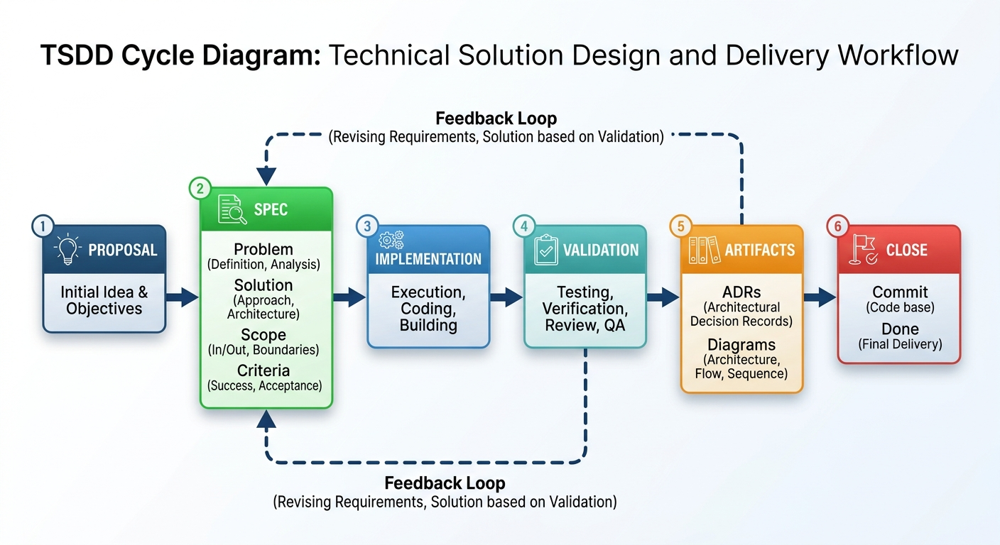

# Thin Spec Driven Development (TSDD)

> *Clear enough for an agent to execute. Lean enough for a human to maintain.*

**Author:** [Boris Belmar](https://dobleb.cl) / [dobleB.cl](https://dobleb.cl)


---

## The Problem

Modern development teams have two failure modes:

**Vibe Coding** — move fast, prompt aggressively, ship something that looks right but drifts from intent. No documentation. No decisions recorded. Technical debt accumulates silently.

**Over-Specced** — heavy frameworks, dozens of Markdown files, PRDs, architecture docs, acceptance criteria matrices. The process becomes the product. Teams drown in documentation before writing a single line of code.

Both extremes share the same root cause: **no shared compass**.

---

## What is TSDD?

Thin Spec Driven Development is a **methodology**, not a framework.

It is a compass — a set of principles and stages that guide a development team from idea to repository. Each team implements it the way it makes sense for them: with AI agents, with plain Markdown files, with sticky notes on a wall. The tooling is irrelevant. The thinking is what matters.

The core premise:

> **A Spec exists to give an agent — human or AI — everything it needs to execute a task correctly, without ambiguity, and without asking twice.**

TSDD is designed for the modern development cycle: one where AI agents are active participants in implementation. A Spec is not a summary for a manager or a design document for a committee. It is an executable contract — clear, technically grounded, and free of noise.

TSDD borrows from Lean Thinking — eliminate waste, deliver value early, decide as late as responsible. A spec full of business verbosity is waste. A spec full of implementation trivia is also waste. A decision that nobody recorded is a future incident.

---

## Quickstart

TSDD ships with a set of agent skills that implement each stage of the workflow. You can install all of them or pick only the ones you need for your team and context.

```bash
# Install all skills
npx skills add borisbelmar/tsdd

# Or install individual skills
npx skills add borisbelmar/tsdd@tsdd-init
npx skills add borisbelmar/tsdd@spec-writer
npx skills add borisbelmar/tsdd@spec-implement
npx skills add borisbelmar/tsdd@proposal-writer
npx skills add borisbelmar/tsdd@agents-writer
```

Then start a new project:

```bash
# Invoke the tsdd-init skill in your agent
```

It will discover your project context, propose a docs structure, set up AGENTS.md, and guide you to your first spec.

---

## Prerequisites

TSDD works well when two engineering disciplines are already in place. They are not part of the methodology — they are the foundation it runs on.

---

### Context Engineering

Every agent in a TSDD workflow operates on two distinct layers of context:

**Project Context** — the stable, always-present knowledge about the project: architecture, tech stack, coding conventions, folder structure, dependencies, and team boundaries. This lives in files like `AGENTS.md`, `CLAUDE.md`, `.cursorrules`, or equivalent. It is written once and maintained continuously. The agent carries it into every task without being reminded.

**Task Context (the Spec)** — the specific, temporary context for a single task or feature. This is what TSDD defines as the Spec. It is scoped, task-bound, and expires when the cycle closes.

These two layers are distinct. **A Spec never restates the Project Context.** If a Spec explains the stack, the framework, or the team's conventions, it is carrying fat that belongs elsewhere.

Beyond these two layers, a mature context setup may include:

| Tool | Purpose |
|---|---|
| MCP servers | Give agents access to external systems (repos, docs, databases, APIs) |
| Skills | Reusable, scoped behaviors the agent can invoke |
| RAG | Retrieve relevant knowledge from large documentation or codebases |
| Memory banks | Persist decisions, patterns, and learned context across sessions |
| Artifacts | Outputs from previous TSDD cycles that inform the next |

> **Context is infrastructure. Treat it like code.**  
> Version it, maintain it, and review it. Stale or noisy context produces stale or noisy implementations.

---

### Harness Engineering

The harness is the wiring that makes context usable. A well-engineered harness defines:

- **What context gets injected** — and when, for which type of task
- **Which tools are available** — MCPs, Skills, and capabilities scoped per agent or per stage
- **Agent boundaries** — what the agent can do autonomously, what requires approval, and what is off-limits

A practical harness uses a three-tier boundary model:

| Tier | Meaning | Example |
|---|---|---|
| ✅ Always | Execute without asking | Run tests before committing |
| ⚠️ Ask first | Pause and confirm | Add a new dependency, change a schema |
| 🚫 Never | Hard stop | Commit secrets, modify CI config, touch vendor files |

The harness is not part of the Spec. It is part of the agent's operating environment — defined once at the project level, not per task.

---

> **TSDD is fully applicable when context engineering and harness engineering are in place.**  
> Without them, the methodology still provides structure — but the agent will need more human intervention to compensate for missing context and undefined boundaries.

---

## Core Principles

**1. Human in the loop — always.**  
The developer is not an approver at the end of the pipeline. They are a collaborator at every stage. The agent executes; the human directs, refines, and validates. An agent left alone will drift. A developer without an agent will slow down. TSDD is the collaboration contract between them.

**2. The spec serves the team, not the process.**  
No spec artifact should exist solely to satisfy a methodology. If it doesn't help the team build better or faster, drop it.

**3. Decide as late as responsible.**  
Don't document decisions before you have enough information to make them well. The Proposal explores. The Spec decides. Artifacts record.

**4. The loop closes at the repository.**  
A workflow that ends before the commit is incomplete. Code, decisions, and history belong together.

**5. Modularity over prescription.**  
Not every feature needs User Stories. Not every task needs an ADR. TSDD stages are building blocks — use the ones that fit the context.

**6. Artifacts reflect reality.**  
Generated artifacts (diagrams, ADRs, specs) should describe what was actually built, not what was imagined at the start.

**7. Context is infrastructure.**  
A clean, well-maintained Project Context and a well-engineered harness are prerequisites, not afterthoughts. The quality of the output is directly proportional to the quality of the context.

---

## The Workflow



---

## Human in the Loop

**This is TSDD's first principle in practice.**

TSDD is not an autonomous pipeline. The developer is an active participant at every stage — not as an approver at the end, but as a collaborator throughout. The agent executes; the human directs, refines, and validates.

Human-in-the-loop in TSDD means:

**At the Proposal** — explore with the agent. Challenge its assumptions. Ask it to generate diagrams, identify risks, surface open decisions. The Proposal is done when *you* understand the problem well enough, not when the agent stops generating.

**At User Stories** — have the agent draft them, then push back. Are the acceptance criteria testable? Is the scope realistic? Are there stories that should be merged or split?

**At the Spec** — this is where the collaboration is most critical. Use the agent to:
- Complete sections you haven't fully thought through
- Identify ambiguities ("what happens if X?")
- Challenge scope ("is this in or out of scope?")
- Validate technical decisions ("is this the right approach given the project context?")

The Spec is ready when neither you nor the agent has an unanswered question about the task.

**During Implementation** — don't walk away. Redirect when the agent drifts. Ask it to document inline decisions. If a technical constraint surfaces, update the Spec together before continuing.

**At Artifacts** — ask the agent to generate the ADR, diagram, or contract. Review it. Push back if it doesn't reflect what was actually built. The artifact is a collaboration, not an automated output.

**At Commit and MR** — the human takes the wheel. Review that the commit message and MR description accurately represent the intent, the decisions made, and the artifacts generated. This is the permanent record.

---

> **The quality of a TSDD cycle is directly proportional to the quality of the human-agent collaboration.**  
> An agent left alone will drift. A developer working without an agent will slow down. Together, with a clean Spec as shared ground, they compound each other's strengths.

---

## The Stages

### 1. Proposal

The starting point. A Proposal is a **hybrid artifact** — it mixes business intent with technical thinking from day one.

A Proposal should answer:
- What problem are we solving, and for whom?
- What are the main technical constraints or decisions pending?
- What does the system look like at a high level? *(use diagrams — Mermaid or equivalent)*

A Proposal is **not** a requirements document. It's a structured brainstorm. It ends when the team has enough shared understanding to move forward.

**Output:** A short document with context, a rough architecture diagram, and a list of open decisions.

---

### 2. User Stories *(optional)*

Use User Stories when:
- A product team or business stakeholders are involved
- The work is large enough to benefit from decomposition
- Multiple developers will work in parallel

Skip User Stories when:
- The task is purely technical
- The team already shares full context
- It's a solo developer with a clear goal

User Stories in TSDD follow a simple structure:
```
As a [role], I want [capability], so that [outcome].
Acceptance criteria: [testable conditions]
```

No ceremony. No Gherkin required unless the team finds value in it.

---

### 3. Spec

The Spec is the **central artifact** of TSDD. It is the contract between intent and execution — written for the agent (human or AI) that will implement it.

A well-written Spec is:
- **Technically precise** — it defines what needs to be built at the implementation level: data structures, endpoints, behaviors, constraints, edge cases
- **Unambiguous** — an agent reading it should not need to infer, assume, or ask clarifying questions to begin work
- **Bounded** — it defines explicit scope and explicit exclusions
- **Free of noise** — no business justification essays, no stakeholder language, no implementation trivia

A Spec should define:
- **Context** — what problem this solves and where it fits in the system (one paragraph max)
- **Scope** — what will be built, expressed technically
- **Out of scope** — explicit exclusions to prevent drift
- **Technical requirements** — data models, API contracts, business rules, constraints, error handling
- **Acceptance criteria** — testable conditions that define "done"
- **Open questions** — unresolved decisions that need to be made during implementation

**A Spec is not thin because it's short. It's thin because it carries no fat.**

A Spec for a complex feature may be several pages. A Spec for a simple task may be half a page. Length is not the measure — precision and clarity are.

A Spec is **alive**. It is updated as implementation reveals new information. The final state of the Spec reflects what was actually built — not what was originally imagined.

> **A Spec assumes the Project Context. It never restates it.**  
> Stack, conventions, folder structure, and team boundaries belong in the Project Context — not in the Spec. A Spec that explains the framework is carrying someone else's weight.

---

**What a Spec is not:**
- A PRD or business requirements document
- A design document with exhaustive diagrams
- A conversation summary
- A placeholder to be filled in later

---

### 4. Implementation

Build against the Spec. When reality diverges from the Spec, update the Spec — don't silently abandon it.

The implementation stage has one rule: **keep the Spec honest**.

---

### 5. Artifacts

Once implementation is complete (or at meaningful checkpoints), generate the artifacts that serve the team and the future.

Artifacts in TSDD are **contextual** — use what the situation calls for:

| Situation | Artifact |
|---|---|
| An architectural decision was made | ADR (Architecture Decision Record) |
| A new service or module was created | Architecture diagram |
| An API was defined or changed | API contract (OpenAPI, Bruno collection) |
| A complex flow was implemented | Sequence or flow diagram |
| A security or compliance decision | Decision log |

No situation requires all of these. One may require none.

---

### 6. Commit

Write a commit message that connects to the Spec and any generated artifacts.

Follow [Conventional Commits](https://www.conventionalcommits.org/) or your team's convention. The commit is the final link between intent and code.

```
feat(auth): implement JWT refresh token rotation

Spec: docs/specs/auth-refresh.md
ADR: docs/adr/0012-jwt-rotation-strategy.md
```

---

### 7. Merge Request

The MR description is not a summary of the diff. It's a summary of the **intent**, the **decisions made**, and the **artifacts generated**.

A TSDD MR description references:
- The Spec (or User Story) it implements
- Any artifacts generated during the process
- Open questions or follow-up tasks

This makes code review faster and the project history meaningful.

---

## What TSDD Is Not

**Not a replacement for Agile.** TSDD is compatible with Scrum, Kanban, or any other framework. It operates at the task and feature level, not the process level.

**Not a tool.** There is no CLI to install, no platform to sign up for, no templates required. Any text editor and a Git repository are sufficient.

**Not waterfall.** The Spec is alive. Artifacts are generated post-implementation. Decisions are made as late as responsible.

**Designed for agent-driven development, not dependent on it.** TSDD is built for the reality that AI agents are now active participants in the development cycle. The Spec format is optimized for agent consumption — precise, unambiguous, technically grounded. But the methodology works with human developers too. The discipline is the same.

---

## Comparison

| | Vibe Coding | BMAD / Spec Kit | **TSDD** |
|---|---|---|---|
| Spec overhead | None | High | Precise, no fat |
| Tooling required | None | Yes | None |
| Agent-ready Spec | No | Yes | Yes |
| Human in the loop | Reactive | Approval gates | Active collaborator |
| Context engineering | Ignored | Bundled in tool | Explicit prerequisite |
| Harness engineering | None | Partial | Explicit prerequisite |
| Closes to repo | No | Partial | Yes |
| Works without AI | Yes | No | Yes |
| Team-size fit | Solo | Medium–Large | Any |
| Artifacts | None | Pre-implementation | Post-implementation |
| Philosophy | Explore | Prescribe | Orient |

---

## Frequently Asked Questions

**How thin is "thin"?**  
Thin means no fat — not short. A Spec is thin when every line serves the agent executing it. Business justifications, stakeholder context, and implementation trivia are fat. Technical precision, constraints, acceptance criteria, and edge cases are not.

**What if my team doesn't have context engineering in place yet?**  
TSDD still works, but the agent will need more human intervention to fill in what the context doesn't provide. Think of it as driving with partial instrumentation — you can still reach the destination, but the ride is rougher. Start with a minimal `AGENTS.md` and evolve from there.

**What goes in the Project Context vs. the Spec?**  
If it applies to every task in the project, it belongs in the Project Context. If it is specific to this task and expires when the cycle closes, it belongs in the Spec. When in doubt: would another Spec for a different feature need this information? If yes, it's Project Context.

**Does TSDD require AI agents?**  
No. TSDD is designed with AI agents in mind — the Spec format is optimized for agent consumption — but it works equally well with human developers. The discipline of writing a clear, unambiguous Spec benefits any executor.

**What makes a Spec "agent-ready"?**  
An agent-ready Spec leaves nothing to inference. It defines the data structures, the expected behaviors, the error cases, and the acceptance criteria explicitly. If an agent has to guess or ask, the Spec has failed.

**Do I need all seven stages?**  
No. A solo developer on a technical task might use only Spec → Implementation → Commit. A product team building a user-facing feature might use all seven. TSDD is modular by design.

**What if the Spec is wrong?**  
Update it. A wrong spec that gets corrected is more valuable than no spec at all — it records that the team learned something.

**Is TSDD compatible with existing SDD tools?**  
Yes. Kiro, Spec Kit, or BMAD can be used to implement specific TSDD stages. TSDD doesn't prescribe how each stage is executed.

---

## Examples

See TSDD applied to different team sizes and contexts in the [examples/](examples/) directory:

| Scenario | Guide |
|---|---|
| Solo developer, personal project | [examples/solo-developer-personal.md](examples/solo-developer-personal.md) |
| Solo developer, client with backlog | [examples/solo-developer-client.md](examples/solo-developer-client.md) |
| Small team (2-3 devs) | [examples/small-team.md](examples/small-team.md) |
| Large team (7-8 devs) | [examples/large-team.md](examples/large-team.md) |

---

## Skills

TSDD ships with a set of agent skills that implement each stage of the workflow.
Skills live under `skills/` and can be installed into any agent that supports the skill format.

| Skill | Purpose |
|---|---|
| [`tsdd-init`](skills/tsdd-init/SKILL.md) | Guide a user through initializing a new project with TSDD — discover context, propose docs structure, set up AGENTS.md, recommend tools, and choose the next stage |
| [`proposal-writer`](skills/proposal-writer/SKILL.md) | Write structured proposals that mix business intent with technical thinking — problem, scope, diagrams, planned specs, and open decisions |
| [`spec-writer`](skills/spec-writer/SKILL.md) | Write and maintain TSDD specs — the executable contracts between intent and implementation. Handles new specs, updates, and splitting |
| [`spec-implement`](skills/spec-implement/SKILL.md) | Implement a TSDD spec end-to-end — read, plan, apply changes, run validation, update the spec, and close the cycle |
| [`agents-writer`](skills/agents-writer/SKILL.md) | Create or edit AGENTS.md files with project context, TSDD guidelines, and harness boundaries |

---

## Status

> **This is a methodology proposal currently being socialized.**  
> TSDD is in draft status until it sees real-world adoption and usage. We're sharing it to gather feedback, identify gaps, and refine it through actual use. Once it has been applied by multiple teams across different contexts, the status will move from Draft to Stable. Critiques, case studies, and real-world experiences are welcome.

---

## Changelog

See [CHANGELOG.md](CHANGELOG.md) for a history of changes to TSDD.

---

## Contributing

TSDD is an open methodology. If your team has adapted it, found gaps, or improved a stage — contribute back.

Discussions, critiques, and real-world case studies are more valuable than theoretical improvements.

---

*TSDD is released under [Creative Commons CC BY 4.0](https://creativecommons.org/licenses/by/4.0/). Share it, adapt it, build on it.*